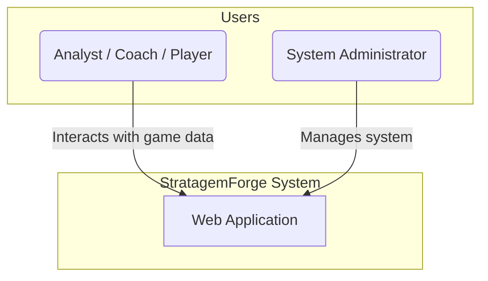
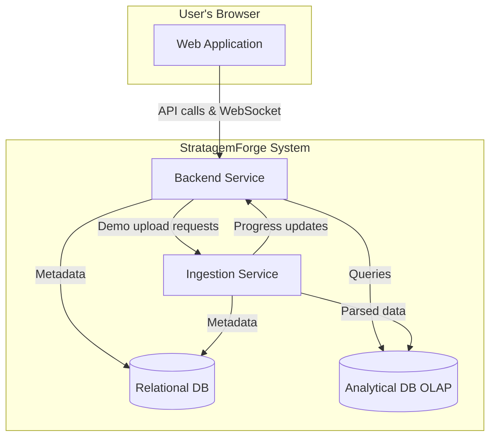

# High-Level Architecture: StratagemForge

This document provides a high-level overview of the StratagemForge system architecture, using the C4 model for visualization.

## Level 1: System Context

The System Context diagram shows how the StratagemForge system fits into its environment, including its users.

### Actors & Systems

*   **Analyst / Coach / Player:** The primary users of the system. At this stage, they share the same permissions to interact with game data.
*   **System Administrator:** A user responsible for managing the system, including user accounts and system-wide settings.
*   **StratagemForge System:** The system being built.

## Level 2: Container Diagram

The Container diagram zooms into the StratagemForge system to show its major building blocks. This design separates the concerns of general application logic from the heavy-duty processing of demo files.

### Containers

*   **Web Application:**
    *   **Description:** A single-page application (SPA) that provides all user-facing functionality. The frontend is completely decoupled from the backend, communicating only through the Backend Service via well-defined REST APIs and WebSocket connections.
    *   **Technology:** Deliberately technology-agnostic to allow experimentation (e.g., React, Vue, Svelte, Angular, or even mobile frameworks like React Native/Flutter).
    *   **Responsibility:** Renders the UI and communicates exclusively with the Backend Service. Contains no business logic and has no direct access to other internal services.

*   **Backend Service:**
    *   **Description:** A unified service that provides both REST API endpoints and WebSocket connections. Acts as the single entry point for all user interactions and mediates access to internal services.
    *   **Technology:** To be determined. Must support both HTTP and WebSocket protocols (e.g., Node.js/Express with Socket.IO, Python/FastAPI with WebSockets, or ASP.NET Core).
    *   **Responsibility:** Provides complete REST API, handles authentication/authorization, manages WebSocket connections for real-time updates, orchestrates demo uploads with the Ingestion Service, and controls access to all internal services.

*   **Ingestion Service:**
    *   **Description:** An internal service for processing CS:GO demo files. This service is not directly accessible to users and only communicates with the Backend Service.
    *   **Technology:** To be determined. Likely a language with good support for binary file parsing (e.g., Go, C#, or Python with `awpy`).
    *   **Responsibility:** Receives demo files from Backend Service, parses them, transforms the data, writes results to appropriate databases, and reports progress back to Backend Service via API calls.

*   **Relational DB:**
    *   **Description:** The persistent storage for transactional, general-purpose system data.
    *   **Technology:** To be determined (e.g., PostgreSQL, SQLite for local development).
    *   **Responsibility:** Stores user accounts, demo metadata (e.g., map, teams, score), user-generated notes, and tags.

*   **Analytical DB (OLAP):**
    *   **Description:** A storage solution optimized for large-scale analytical queries on game tick data.
    *   **Technology:** Columnar file format (e.g., Apache Parquet) stored on disk.
    *   **Responsibility:** Stores the high-volume, structured data from game ticks for fast and efficient analysis.

## High-Level Features Mapping

This section maps the primary features to the containers that will implement them.

| Feature                  | Web App | Backend Service | Ingestion Service | Relational DB | Analytical DB |
| ------------------------ | :-----: | :-------------: | :---------------: | :-----------: | :-----------: |
| **User Authentication**  |    X    |        X        |                   |       X       |               |
| **Game/Demo Management** |    X    |        X        |                   |       X       |               |
| **Manual Demo Upload**   |    X    |        X        |         X         |       X       |       X       |
| **Data Analysis/Queries**|    X    |        X        |                   |               |       X       |
| **Real-time Updates**    |    X    |        X        |         X         |               |               |

## Service Communication Security

### Internal Service Access Control
*   **Backend Service as Mediator:** All user requests go through the Backend Service, which acts as the single point of entry
*   **No Direct User Access:** Users cannot directly communicate with the Ingestion Service, databases, or other internal services
*   **Service-to-Service Authentication:** Internal services authenticate with each other using secure tokens/certificates
*   **Network Isolation:** Internal services can be deployed on private networks, only accessible to the Backend Service

## API Design Principles

To enable frontend technology experimentation, the system follows strict API-first design principles:

### Complete Backend API Coverage
*   **RESTful APIs:** All business operations are exposed through well-designed REST endpoints
*   **No Business Logic in Frontend:** The frontend contains zero business rules - it's purely a presentation layer
*   **Comprehensive Data Access:** Every piece of data the UI needs is available through API endpoints
*   **Consistent Response Formats:** All APIs follow the same response structure (JSON with consistent error handling)

### Technology-Agnostic Interface
*   **Standard HTTP/JSON:** Uses universal web standards that work with any frontend framework
*   **CORS-Enabled:** Properly configured for cross-origin requests to support different development setups
*   **WebSocket Standards:** Real-time features use standard WebSocket protocols compatible with all frameworks
*   **OpenAPI Documentation:** API endpoints will be documented with OpenAPI/Swagger for easy frontend development

### Frontend Flexibility Benefits
*   **Framework Swapping:** Can replace React with Vue, Svelte, Angular, or any other framework without backend changes
*   **Multiple Frontends:** Could support web app, mobile app, and desktop app simultaneously
*   **Development Speed:** Different developers can work on different frontend experiments independently
*   **Technology Evaluation:** Easy to prototype and compare different frontend approaches

## Appendix: Mermaid Shape Reference

This section shows all available Mermaid shapes for future diagram updates.

### Shape Syntax Reference

- **`A[Text]`** - Rectangle/Box (most common)
- **`B(Text)`** - Rounded rectangle
- **`C([Text])`** - Stadium/Pill shape (start/end nodes)
- **`D[[Text]]`** - Subroutine/Process with double borders
- **`E[(Text)]`** - Database/Cylinder (for data storage)
- **`F((Text))`** - Circle
- **`G>Text]`** - Asymmetric/Flag shape
- **`H{Text}`** - Diamond (decision/conditional)
- **`I{{Text}}`** - Hexagon
- **`J[/Text/]`** - Parallelogram (input/output)
- **`K[\Text\]`** - Alternative parallelogram
- **`L[/Text\]`** - Trapezoid
- **`M[\Text/]`** - Alternative trapezoid
