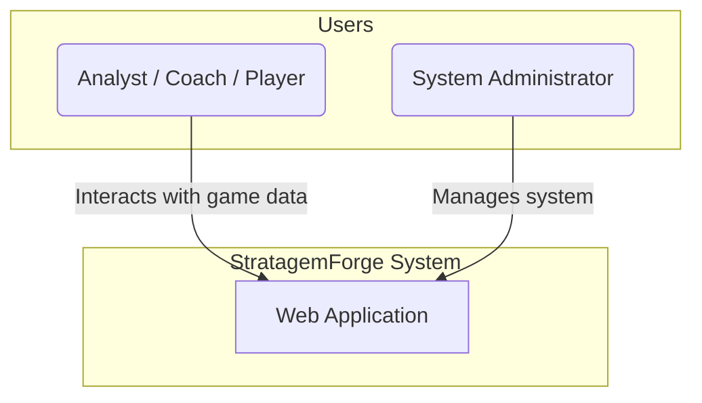
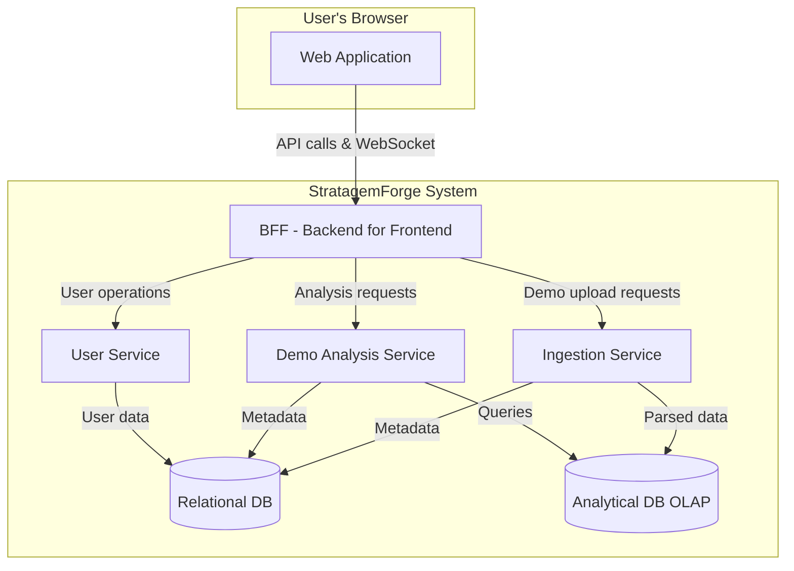
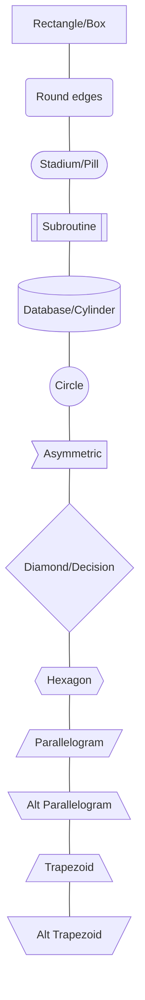

# High-Level Architecture: StratagemForge

This document provides a high-level overview of the StratagemForge system architecture, using the C4 model for visualization.

## Level 1: System Context

The System Context diagram shows how the StratagemForge system fits into its environment, including its users.

### Actors & Systems

*   **Analyst / Coach / Player:** The primary users of the system. At this stage, they share the same permissions to interact with game data.
*   **System Administrator:** A user responsible for managing the system, including user accounts and system-wide settings.
*   **StratagemForge System:** The system being built.

## Level 2: Container Diagram

The Container diagram zooms into the StratagemForge system to show its major building blocks. This design separates the concerns of general application logic from the heavy-duty processing of demo files.

### Containers

*   **Web Application:**
    *   **Description:** A single-page application (SPA) that provides all user-facing functionality. The frontend is completely decoupled from internal services, communicating only through the BFF.
    *   **Responsibility:** Renders the UI and communicates exclusively with the BFF. Contains no business logic and has no direct access to internal services.

*   **BFF (Backend for Frontend):**
    *   **Description:** A specialized API layer designed specifically for frontend needs. Orchestrates calls to internal services and provides a unified, frontend-optimized interface.
    *   **Responsibility:** Provides tailored REST APIs, handles authentication/authorization, manages WebSocket connections, aggregates data from multiple services, and acts as the single point of contact for the frontend.

*   **User Service:**
    *   **Description:** Handles all user-related operations including authentication, authorization, and user profile management.
    *   **Responsibility:** User authentication, session management, user profiles, and role-based access control (RBAC).

*   **Demo Analysis Service:**
    *   **Description:** Specialized service for performing complex analysis on parsed demo data. Handles analytical queries and generates insights.
    *   **Responsibility:** Executes analytical queries against the OLAP database, generates statistical reports, calculates game metrics, and provides data insights.

*   **Ingestion Service:**
    *   **Description:** An internal service for processing CS:GO demo files. Only accessible through the BFF for security and coordination.
    *   **Responsibility:** Receives demo files from BFF, parses them, transforms the data, writes results to databases, and reports progress back through the BFF.

*   **Relational DB:**
    *   **Description:** The persistent storage for transactional, general-purpose system data.
    *   **Responsibility:** Stores user accounts, demo metadata (e.g., map, teams, score), user-generated notes, and tags.

*   **Analytical DB (OLAP):**
    *   **Description:** A storage solution optimized for large-scale analytical queries on game tick data.
    *   **Responsibility:** Stores the high-volume, structured data from game ticks for fast and efficient analysis.

## High-Level Features Mapping

This section maps the primary features to the containers that will implement them.

| Feature                  | Web App | BFF | User Service | Demo Analysis Service | Ingestion Service | Relational DB | Analytical DB |
| ------------------------ | :-----: | :-: | :----------: | :-------------------: | :---------------: | :-----------: | :-----------: |
| **User Authentication**  |    X    |  X  |      X       |                       |                   |       X       |               |
| **Game/Demo Management** |    X    |  X  |              |           X           |                   |       X       |               |
| **Manual Demo Upload**   |    X    |  X  |              |                       |         X         |       X       |       X       |
| **Data Analysis/Queries**|    X    |  X  |              |           X           |                   |               |       X       |
| **Real-time Updates**    |    X    |  X  |              |           X           |         X         |               |               |

## Service Communication Security

### Internal Service Access Control
*   **Backend Service as Mediator:** All user requests go through the Backend Service, which acts as the single point of entry
*   **No Direct User Access:** Users cannot directly communicate with the Ingestion Service, databases, or other internal services
*   **Service-to-Service Authentication:** Internal services authenticate with each other using secure tokens/certificates
*   **Network Isolation:** Internal services can be deployed on private networks, only accessible to the Backend Service

## API Design Principles

To enable frontend technology experimentation, the system follows strict API-first design principles:

### Complete Backend API Coverage
*   **RESTful APIs:** All business operations are exposed through well-designed REST endpoints
*   **No Business Logic in Frontend:** The frontend contains zero business rules - it's purely a presentation layer
*   **Comprehensive Data Access:** Every piece of data the UI needs is available through API endpoints
*   **Consistent Response Formats:** All APIs follow the same response structure with consistent error handling

### Technology-Agnostic Interface
*   **Standard HTTP/JSON:** Uses universal web standards that work with any frontend framework
*   **CORS-Enabled:** Properly configured for cross-origin requests to support different development setups
*   **WebSocket Standards:** Real-time features use standard WebSocket protocols compatible with all frameworks
*   **OpenAPI Documentation:** API endpoints will be documented with OpenAPI/Swagger for easy frontend development

### Frontend Flexibility Benefits
*   **Framework Swapping:** Can replace one frontend framework with another without backend changes
*   **Multiple Frontends:** Could support web app, mobile app, and desktop app simultaneously
*   **Development Speed:** Different developers can work on different frontend experiments independently
*   **Technology Evaluation:** Easy to prototype and compare different frontend approaches

## Authentication Strategy

### Simple OAuth-Ready Design
The system uses a straightforward authentication approach that can easily evolve:

**Phase 1: Basic Implementation**
*   **Local Authentication:** Simple username/password stored in Relational DB
*   **JWT Tokens:** Stateless session management that works with any auth method
*   **Abstract Auth Interface:** Backend designed to support multiple auth providers

**Phase 2: OAuth Integration (Future)**
*   **Third-party OAuth:** Add providers without changing core architecture
*   **Unified User Model:** User table designed to handle multiple auth sources
*   **Backwards Compatible:** Existing local accounts continue to work

**Key Principle:** Frontend only knows about JWT tokens, never about the authentication method used to obtain them.

## Backend for Frontend (BFF) Pattern

### BFF Design Principles
The BFF serves as a specialized API layer that follows these best practices:

**Frontend-Optimized APIs:**
*   **Aggregated Responses:** Combines data from multiple services into single API calls tailored for specific UI screens
*   **Reduced Network Calls:** Minimizes round-trips by providing exactly the data the frontend needs
*   **Frontend-Friendly Formats:** Transforms backend data into structures optimized for UI consumption

**Service Orchestration:**
*   **Centralized Coordination:** Manages complex workflows across multiple backend services
*   **Error Handling:** Provides consistent error responses and graceful degradation
*   **Transaction Management:** Coordinates operations that span multiple services

**Security & Authentication:**
*   **Single Point of Authentication:** All user requests authenticated at the BFF level
*   **Service-to-Service Security:** Manages secure communication with internal services
*   **Authorization Layer:** Implements RBAC and access control before forwarding requests

### Benefits of This Approach
*   **Clean Separation:** Frontend completely isolated from internal service complexity
*   **Independent Evolution:** Backend services can change without affecting frontend
*   **Performance Optimization:** Reduces chatty interfaces and optimizes for frontend needs
*   **Security:** Internal services protected behind the BFF layer

## Service Contracts & Integration

### API Contract Management
To ensure services can be replaced with different implementations without breaking the system:

**Contract Documentation:**
*   **OpenAPI Specifications:** Each service maintains a comprehensive OpenAPI/Swagger specification
*   **Contract-First Development:** API contracts defined before implementation begins
*   **Versioning Strategy:** Semantic versioning for all service APIs with backward compatibility
*   **Contract Repository:** Centralized location for all service API contracts (e.g., `contracts/` directory)

**Service Interface Standards:**
*   **Standardized Endpoints:** Consistent naming conventions and HTTP methods across all services
*   **Common Response Formats:** Unified error handling, pagination, and data envelope structures
*   **Authentication Headers:** Consistent JWT token validation across all internal services
*   **Health Check Endpoints:** Standard `/health` and `/ready` endpoints for all services

### Integration Testing Strategy
**Master Integration Test Suite:**
*   **Contract Testing:** Automated tests that validate each service adheres to its API contract
*   **End-to-End Workflows:** Tests that exercise complete user journeys across multiple services
*   **Service Replacement Tests:** Specific tests to verify new service implementations maintain compatibility
*   **Performance Baselines:** Integration tests that ensure service replacements don't degrade performance

**Testing Implementation:**
*   **Consumer-Driven Contracts:** Each service consumer defines expectations that producers must meet
*   **Automated Contract Validation:** CI/CD pipelines automatically validate contract compliance
*   **Service Virtualization:** Ability to test against mock services during development
*   **Regression Prevention:** Integration tests prevent breaking changes during service updates

This approach ensures that replacing the User Service from Go to Python (or any similar technology change) can be done confidently without breaking existing functionality.

## Appendix: Mermaid Shape Reference

This section shows all available Mermaid shapes for future diagram updates.

### Shape Syntax Reference

- **`A[Text]`** - Rectangle/Box (most common)
- **`B(Text)`** - Rounded rectangle
- **`C([Text])`** - Stadium/Pill shape (start/end nodes)
- **`D[[Text]]`** - Subroutine/Process with double borders
- **`E[(Text)]`** - Database/Cylinder (for data storage)
- **`F((Text))`** - Circle
- **`G>Text]`** - Asymmetric/Flag shape
- **`H{Text}`** - Diamond (decision/conditional)
- **`I{{Text}}`** - Hexagon
- **`J[/Text/]`** - Parallelogram (input/output)
- **`K[\Text\]`** - Alternative parallelogram
- **`L[/Text\]`** - Trapezoid
- **`M[\Text/]`** - Alternative trapezoid
