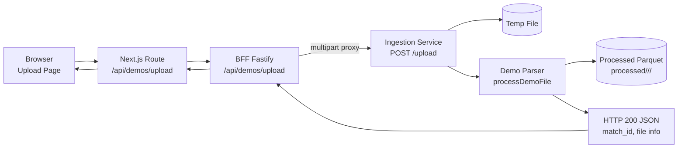

# Before

```mermaid

flowchart LR
    A[Browser\nUpload Page] --> B[Next.js Route\n/api/demos/upload]
    B --> C[BFF Fastify\n/api/demos/upload]
    C -->|multipart proxy| D[Ingestion Service\nPOST /upload]
    D --> E[(Temp File)]
    D --> F[Demo Parser\nprocessDemoFile]
    F --> G[(Processed Parquet\nprocessed/<date>/<map>/<match>)]
    F --> H[HTTP 200 JSON\nmatch_id, file info]
    H --> C --> B --> A


```
